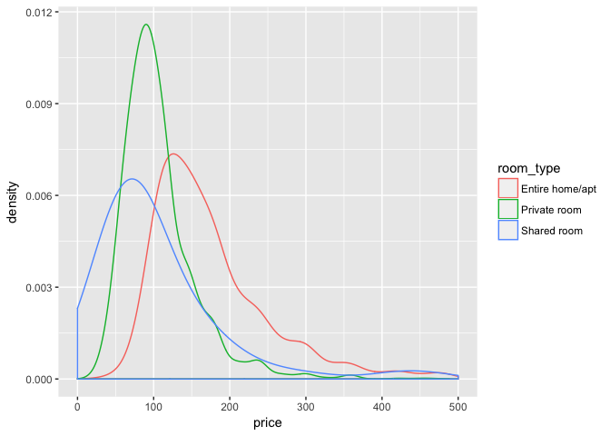
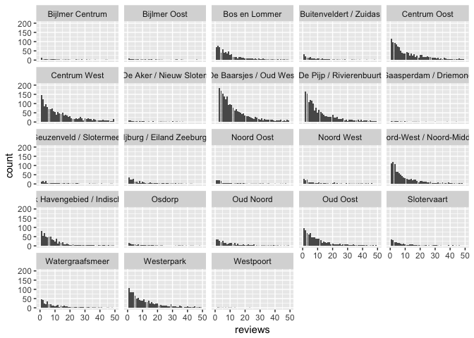
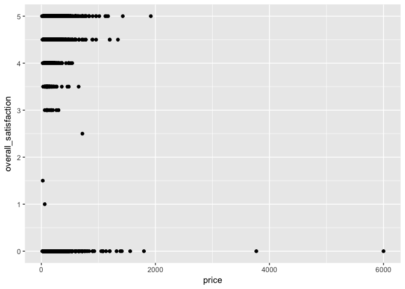
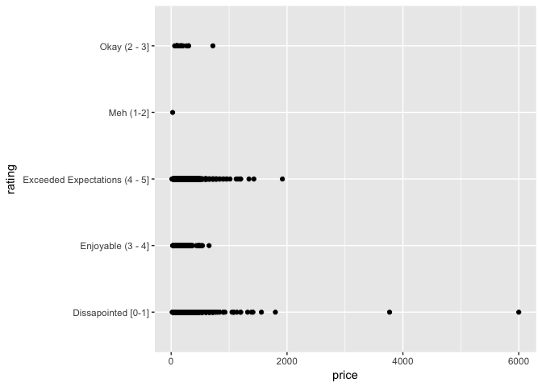
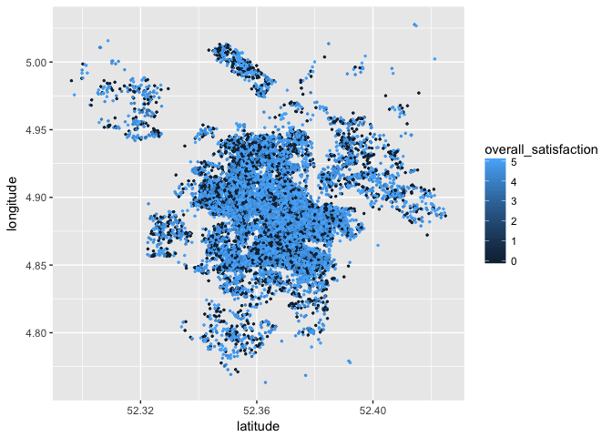

Project 1: R Visualization
================

GitHub Documents
----------------

This is an R Markdown format used for publishing markdown documents to GitHub. When you click the **Knit** button all R code chunks are run and a markdown file (.md) suitable for publishing to GitHub is generated.

Including Code
--------------

You can include R code in the document as follows:

``` r
summary(cars)
```

    ##      speed           dist       
    ##  Min.   : 4.0   Min.   :  2.00  
    ##  1st Qu.:12.0   1st Qu.: 26.00  
    ##  Median :15.0   Median : 36.00  
    ##  Mean   :15.4   Mean   : 42.98  
    ##  3rd Qu.:19.0   3rd Qu.: 56.00  
    ##  Max.   :25.0   Max.   :120.00

Including Plots
---------------

You can also embed plots, for example:


Note that the `echo = FALSE` parameter was added to the code chunk to prevent printing of the R code that generated the plot.

Would you stay in an Air BnB?
-----------------------------

If I'm completely honest, I don't think I have travelled enough. I have an annoying desire to see as much of the world as possible. In the few times I have managed to explore the world, I've always preferred to say in an Airbnb. Maybe it's because I'm typically a millenial, or maybe it's because I love the genius behind the product offering!

Therefore, it's no surprise that when I came across a dataset that housed Airbnb data, I jumped at the opportunity and changed the direction of my project.

But I'm 5 steps ahead of myself here. Let's start with the basics. Airbnb is one of the fastest growing holiday websites. It's an online marketplace that lets people rent out their properties or spare rooms to guests.

There’s plenty of criteria that defines each lease: from a shared room to an entire house, to having a swimming pool or washing machine. There are photos of the property and the hosts, with a full map listing. It's easy to book, often much cheaper than a local hotesl and strongly relies on a peer-review system.

With that in mind, I choose one city I'd love to explore and ventured on an data analysis journey.

Let's head to Amsterdam: The code.
----------------------------------

You've guessed it right, the chosen city is Amsterdam.

The code was found at: <http://tomslee.net/airbnb-data-collection-get-the-data> and documents the survey results as of the 22/07/2017. The data was pulled as a scrape from the Airbnb website. The data contains 18 723 observations of 20 variables which speak to the listings in the city.

Amsterdam 2017 Metadata
=======================

The dataset comprises of the following variables: - room\_id: A unique number identifying an Airbnb listing. - host\_id: A unique number identifying an Airbnb host. - room\_type: One of “Entire home/apt”, “Private room”, or “Shared room” - borough: A subregion of the city or search area for which the survey is carried out. The borough is taken from a shapefile of the city that is obtained independently of the Airbnb web site. For some cities, there is no borough information; for others the borough may be a number. - neighborhood: As with borough: a subregion of the city or search area for which the survey is carried out. For cities that have both, a neighbourhood is smaller than a borough. For some cities there is no neighbourhood information. - reviews: The number of reviews that a listing has received. Airbnb has said that 70% of visits end up with a review, so the number of reviews can be used to estimate the number of visits. - overall\_satisfaction: The average rating (out of five) that the listing has received from those visitors who left a review. - accommodates: The number of guests a listing can accommodate. - bedrooms: The number of bedrooms a listing offers. - bathrooms: The number of bathrooms a listing offers. - price: The price (in $US) for a night stay. - minstay: The minimum stay for a visit, as posted by the host. - name: The name of the listing. - last\_modified: the date and time that the values were read from the Airbnb web site. - latitude: The latitude of the listing as posted on the Airbnb site: this may be off by a few hundred metres. - longitude: The longitude of the listing as posted on the Airbnb site: this may be off by a few hundred metres. - location: The location code.

Let's begin:
============

Geographical mapping of listings
--------------------------------

We begin the exploratory data analysis by reading in the data. Upon inspection, it was found that the overall\_satisfaction (average rating) was a continuos variable. I wanted to make this discrete in order to better view the results. To do this, I created categories for the ratings and added a new variable: rating.

The categories are shown in the code below.

``` r
#Calling all expected packages
library(ggplot2)
library(dplyr)
```

    ## 
    ## Attaching package: 'dplyr'

    ## The following objects are masked from 'package:stats':
    ## 
    ##     filter, lag

    ## The following objects are masked from 'package:base':
    ## 
    ##     intersect, setdiff, setequal, union

``` r
ams_2017 = read.csv('/Users/Gabriella_Camara/Documents/NYDSA/Project1/cities/Amsterdam_2017.csv')

#Adding discrete rankings
nested_ifelse <- function(x)
  ifelse (x >= 0  & x <= 1, 'Dissapointed [0-1]',
  ifelse(x > 1 & x <=  2, "Meh (1-2]", 
  ifelse(x > 2 & x <=  3, 'Okay (2 - 3]',
  ifelse(x > 3 & x <=  4, 'Enjoyable (3 - 4]', 'Exceeded Expectations (4 - 5]') ) ))

ams_2017$rating = sapply(ams_2017$overall_satisfaction, nested_ifelse)
```

After I had stored the data, I wanted to get a better udnerstanding of where all the listings were placed across the city. Additionally, I wanted to see if the ratings varied according to location in an effort to highlight the most favourable spots.

Let's just try this with a simple geom\_point map:

``` r
ams_plot = ggplot(ams_2017, aes(x = latitude, y = longitude)) + geom_point(aes(color = overall_satisfaction), size = 0.5)
ams_plot
```


``` r
#Potential to group_by lat & long/ summarize data/ cluster it?
```

I wanted to incorporate a map underlay in order to get a better, more realistic view of the spread of data.

``` r
# install.packages('ggmap')
# install.packages('mapproj')
library(ggmap)
library(mapproj)
```

    ## Loading required package: maps

``` r
#ams_map = get_map(location = "Amsterdam")
```

Overall Rating
--------------

Before any in depth analysis, let's look at the overall ratings of the Amsterdam listings.

``` r
# Aggregate data according to ratings
ams_ratings = ams_2017 %>% group_by(., rating) %>% summarise(., total = n())
ams_ratings_re = ams_ratings[c(1, 4, 5, 2, 3),] # Order rows in increasing trend
ams_ratings_re
```

    ## # A tibble: 5 x 2
    ##                          rating total
    ##                           <chr> <int>
    ## 1            Dissapointed [0-1]  5749
    ## 2                     Meh (1-2]     1
    ## 3                  Okay (2 - 3]    20
    ## 4             Enjoyable (3 - 4]   686
    ## 5 Exceeded Expectations (4 - 5] 12267

``` r
# ggplot(ams_ratings_re, aes(x = '', y = total, fill = rating)) + geom_bar(stat = 'identity')
ggplot(ams_ratings_re, aes(x = '', y = total, fill = rating)) + geom_bar(stat = 'identity') + coord_polar('y', 0)
```

 From the above, we can see that overall, Amsterdam has a high rating/ satisfaction as it scores largely with Exceeded Expectations and Enjoyable. However, there is a good number of Dissapointed Ratings (fairing in the region of &gt; 5500).

Surprisingly, there are few 'Meh' and 'Okay' ratings as shown in the bar graph below. The count of ratings doesn't seem to follow a normal distribution, and it seems that people either really enjoy or are really dissapointed.

``` r
ratings = c("Dissapointed [0-1]", 'Meh (1-2]', 'Okay (2 - 3]', 'Enjoyable (3 - 4]', 'Exceeded Expectations (4 - 5]')
ggplot(ams_ratings, aes(x = rating, y = total)) + geom_bar(stat = 'identity') + scale_x_discrete(limits = ratings)
```


Number of listins per host
--------------------------

Lets look at the listing per owner (host\_id). This is in an effort to determine how many properties owners would typically list. In order to determine this initially, I ran the code below:

``` r
# This code aggregates data by host_id.
# It resulted in a larger dataset than expected (15 943 observations).
ams_owner = ams_2017 %>% group_by(., host_id) %>% summarise(., num_listings = n())

# In an effort to further summarise the data, I grouped by num_listings. This data frame shows the count of owners with the related number of listings. 
ams_num_group = ams_owner %>% group_by(., num_listings) %>% summarise(., total = sum(num_listings))
summary(ams_num_group)
```

    ##   num_listings       total        
    ##  Min.   : 1.00   Min.   :   13.0  
    ##  1st Qu.: 9.00   1st Qu.:   24.0  
    ##  Median :18.00   Median :   44.0  
    ##  Mean   :27.58   Mean   :  567.4  
    ##  3rd Qu.:37.00   3rd Qu.:   71.0  
    ##  Max.   :93.00   Max.   :14604.0

``` r
# ggplot(ams_num_group, aes(x = num_listings, y = total)) + geom_bar(stat = 'identity')
# This graph was hidden as it didn't explain the data as well as I wish it had. 
```

I did not expect the Number of Listings per individual host to be that high. The maximum of the Number of Listings is 93! That's astronomical for one host/ owner.

This leads me to 3 conclusions: 1. People in Amsterdam are very wealthy and can afford more than one (aka many) house(s). 2. One property could be listed as many different room\_types (i.e. An entire house could also be listed as a shared room/ flat etc.) 3. A 'host' could be an agent that manages many different properties. If this isn't so, I've just come up with a new business idea and will be trade marking it soon.

In order to visualize the data better, I've grouped the number of listings into groups of roughly 30 values. This was done in an effort to show the count of owners with high numbers of property listings.

``` r
less_a = ams_num_group %>% filter(., num_listings < 31)
ggplot(less_a, aes(x = num_listings, y = total)) + geom_bar(stat = 'identity')
```


``` r
less_b = ams_num_group %>% filter(., num_listings > 30 & num_listings < 61)
ggplot(less_b, aes(x = num_listings, y = total)) + geom_bar(stat = 'identity')
```


``` r
less_c = ams_num_group %>% filter(., num_listings > 60 & num_listings < 100)
ggplot(less_c, aes(x = num_listings, y = total)) + geom_bar(stat = 'identity')
```

 The first graph displays a negative distribution, as expected. I would understand that as the number of listings increases, the count of owners with this number of listings would decrease.

From the remaining 2 graphs, you can see the high count of owners with high numbers of listings. How strange, there are more than 75 owners with 93 propoerty listings. (I'm still struggling to believe this!)

In order to explore Conclusion \#2, I wanted to determine if there were any room\_ids that were duplicates. After analysing the data frame, it was shown that room\_id's are the unique keys of the data set (as expected). With no duplicate records, I looked at the data grouped by latitude and longitude positions to see if listings overlapped. This also returned the same number of records. Alas, a dead end.

``` r
# ams_room_duplicate = ams_2017 %>% group_by(., room_id, room_type)
# ams_room_duplicate = ams_2017 %>% group_by(., latitude, longitude)
```

Influential Factors
===================

The other dimension of this analysis was to determine whether or not distinct factors would influence the ratings/ overall\_satisfaction, or if there was a correlation/ relationship between the factor and satisfaction. Further, how these factors influenced the price of the listing.

The factors taken into consideration were namely room\_type and neighborhood. Please note that ratings and overall satisfaction are synonymous. Either is used depending on whether or not discrete or continuos variables were required. Both draw the same conclusions.

Room Type
---------

Let's view room types influence on the ratings.

``` r
#Graph to show relationship between rating and room type
ggplot(ams_2017, aes(y = overall_satisfaction, x = room_type)) + geom_boxplot()
```


``` r
ggplot(ams_2017, aes(x = room_type)) + geom_bar(aes(fill = rating))
```

 The first graph, the box plot, shows the spread of the overall satifaction based on the room type. As you can see, Shared Room's typically have a lower satisfaction than the other room types as its mean is lower.

The second graph, bar chart, shows both the count of listings per room type, as well as the proportion of ratings per room type. 1. As shown, Entire Home/ Apts have a much larger count of ratings and display the largest proportion of avalibale room types in Amsterdam. About 2/3rds of the overall ratings are good. There is a fair number of dissapointed averaged ratings. 2. Private rooms are much less an option to lease and show a similar proportion to Entire Homes. 3. Shared Rooms are very rarely an option in comparison to the others.

Now that we have determined that room types follow a similar trend on overall satisfaction (1/3 dissapointed and 2/3 happy), let's determine how room type influnces the price of a listing.

I started by looking at the maximum price per room type, as well as the general distribution of price per room type.

``` r
room = ams_2017 %>% group_by(., room_type) %>% summarise(., max(price))
room
```

    ## # A tibble: 3 x 2
    ##         room_type `max(price)`
    ##            <fctr>        <dbl>
    ## 1 Entire home/apt         6000
    ## 2    Private room          474
    ## 3     Shared room          462

``` r
ggplot(ams_2017, aes(price, color = room_type)) + geom_density(adjust = 2) + xlim(0, 500)
```

    ## Warning: Removed 198 rows containing non-finite values (stat_density).



``` r
#Removed outliers as to show distribtuion well

# ggplot(ams_2017, aes(y = price, x = room_type)) + geom_boxplot()
```

As shown above, the maximum price of a Entire Home is almost 13 times greater than that of a private/ shared room. Surprisingly, private and shared rooms have very similar maximum prices. I would have imagined that shared rooms would have been cheaper than a private room (no explanation needed).

The density graph speaks to the general distribution of prices per room type. I placed an x limit on the graph in an effort to remove ouliers which distorted the scale of the graph and did not add much value to the analysis. This graph illustrates the density of prices well. Entire Homes have a flatter distribution, which means that the prices are more spread out and shows to be typically more expensive. Where as Private Rooms have a narrower distribution, which highlights a popular price range.

Interesting to note that all room types overlap. You would think that the price curves would be much different especially between Entire Homes and Shared/Private Rooms.

``` r
#Distribution by room_type

ggplot(ams_2017, aes(x = price, y = room_type)) + geom_point()
```


``` r
ggplot(ams_2017, aes(x = room_type, y = price)) + geom_boxplot() + ylim(0,2000) 
```

    ## Warning: Removed 2 rows containing non-finite values (stat_boxplot).


``` r
#Placed a limit on the graph in order to display the points better.
```

The above 2 graphs show the price points per room type. As expected, Entire Homes are responsible for the high spread of prices.

Neighborhood
------------

``` r
ggplot(ams_2017, aes(rating)) + geom_bar(aes(fill = rating)) + facet_wrap(~neighborhood)
```

 \*\*\*\* Explain graphs above

This got me thinking of the popularity of each neighborhood. We can deduce that the number of reviews hint at the popularity of a listing in each neighborhood, as reviews ~= number of vistis. It must be noted that number of visits will be influenced by other factors such as avaliablity, length of stay etc.

``` r
# summary(ams_2017$reviews)
ggplot(ams_2017, aes(reviews)) + geom_bar() + facet_wrap(~neighborhood) + xlim(0,50) + ylim(0,200)
```

    ## Warning: Removed 1341 rows containing non-finite values (stat_count).

    ## Warning: Removed 8 rows containing missing values (geom_bar).

 This graph clearly highlights more popular neighborhoods. These neighborhoods have a greater number of reviews than the others. Popularity per neighborhood, however, can be better visualized by aggreagting the data as shown below:

``` r
#Better explained aggreagted data
reviews = ams_2017  %>% group_by(., neighborhood) %>% summarise(., popularity = sum(reviews))
ggplot(reviews, aes(x = neighborhood, y = popularity)) + geom_bar(stat = 'identity')
```


``` r
ams_neigh = ggplot(ams_2017, aes(y = overall_satisfaction, x = price)) + geom_point()
ams_neigh1 = ggplot(ams_2017, aes(x = bedrooms)) + geom_bar(aes(fill = rating)) + facet_wrap(~ neighborhood)
```

Now that we have determined the overall satisfaction per neighborhood, let's look at the price relationship. The graph below speaks to the distribution of prices per neighborhood. Interesting to note that most neighborhoods follow a similar price curve, although not exactly the same. This is interesting as I would have thought that popularity of neighborhood would have had a more dramatic influence on the price. I.e. Neighborhoods are more popular and therefore have a higher price (a clever play on supply and demand), or neighborhoods are popular because they have a lower price.

``` r
#Distribution by neighborhood
ggplot(ams_2017, aes(price)) + geom_density(adjust = 0.5) + facet_wrap(~neighborhood) + xlim(0, 400)
```

    ## Warning: Removed 514 rows containing non-finite values (stat_density).


Relationship between Price & Overall Satisfaction
-------------------------------------------------

Another question, intersting to ask is does price influence overall satisfaction/ rating. I would think that they were more or less proportional. The more I'd have to pay for a place, the greater I'd like my expereince to be.

``` r
ggplot(ams_2017, aes(x = price, y = overall_satisfaction)) + geom_point()
```



``` r
ggplot(ams_2017, aes(x = price, y = rating)) + geom_point() 
```

 This is the most surpring find. The most expensive priced listing received the lowest rating.

Price Correlations
------------------

Let's view the distribuion of prices of listings in Amsterdam.

``` r
#Distribution by number of rooms
ams_2017 %>% group_by(., bedrooms) %>% summarise(., max(price))
```

    ## # A tibble: 11 x 2
    ##    bedrooms `max(price)`
    ##       <dbl>        <dbl>
    ##  1        0         1199
    ##  2        1         6000
    ##  3        2         1799
    ##  4        3         1558
    ##  5        4         1122
    ##  6        5         1319
    ##  7        6         1016
    ##  8        7         1920
    ##  9        8          540
    ## 10        9          780
    ## 11       10          528

``` r
ggplot(ams_2017, aes(price, color = bedrooms)) + geom_density()
```



``` r
# Not sure why this isn't working?
```

Future work
-----------

Would have liked to incorporate minstay, and see if that influenced the popularity/ rating. I think it would have been an interesting find. However, because this dataset lists the rooms, it does not include an average/ minstay. Incorporate time-series, to predcict the rise of popular neighborhoods, as well as price. Looked at more interesting dat at <http://insideairbnb.com/>
