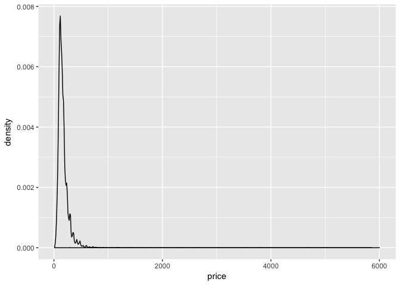

Project 1: R Visualization
================

GitHub Documents
----------------

This is an R Markdown format used for publishing markdown documents to GitHub. When you click the **Knit** button all R code chunks are run and a markdown file (.md) suitable for publishing to GitHub is generated.

Including Code
--------------

You can include R code in the document as follows:

``` r
summary(cars)
```

    ##      speed           dist       
    ##  Min.   : 4.0   Min.   :  2.00  
    ##  1st Qu.:12.0   1st Qu.: 26.00  
    ##  Median :15.0   Median : 36.00  
    ##  Mean   :15.4   Mean   : 42.98  
    ##  3rd Qu.:19.0   3rd Qu.: 56.00  
    ##  Max.   :25.0   Max.   :120.00

Including Plots
---------------

You can also embed plots, for example:


Note that the `echo = FALSE` parameter was added to the code chunk to prevent printing of the R code that generated the plot.

Would you stay in an Air BnB?
-----------------------------

If I'm completely honest, I don't think I have travelled enough.

The code: This code documents the survey results for 2017 (October \* to check). The data contains 18723 observations of 20 variables which speak to the listing in the city and its relative components. We will be exploring a number of them.

``` r
#Calling all expected packages
library(ggplot2)
library(dplyr)
```

    ## 
    ## Attaching package: 'dplyr'

    ## The following objects are masked from 'package:stats':
    ## 
    ##     filter, lag

    ## The following objects are masked from 'package:base':
    ## 
    ##     intersect, setdiff, setequal, union

``` r
ams_2017 = read.csv('/Users/Gabriella_Camara/Documents/NYDSA/Project1/cities/Amsterdam_2017.csv')

#Adding discrete rankings
nested_ifelse <- function(x)
  ifelse (x >= 0  & x <= 1, 'Dissapointed [0-1]',
  ifelse(x > 1 & x <=  2, "Meh (1-2]", 
  ifelse(x > 2 & x <=  3, 'Okay (2 - 3]',
  ifelse(x > 3 & x <=  4, 'Enjoyable (3 - 4]', 'Exceeded Expectations (4 - 5]') ) ))

ams_2017$rating = sapply(ams_2017$overall_satisfaction, nested_ifelse)
```

Now that we have stored the data, the first point of call: plotting the geographical points of the listings. This will highlight the most favouriable spots:

``` r
# install.packages('ggmap')
# install.packages('mapproj')
library(ggmap)
library(mapproj)
```

    ## Loading required package: maps

``` r
#ams_map = get_map(location = "Amsterdam")
```

Let's just try this with a simple geom\_point map:

``` r
ams_plot = ggplot(ams_2017, aes(x = latitude, y = longitude)) + geom_point(aes(color = overall_satisfaction), size = 0.5)
ams_plot
```



``` r
#Need to cut variables in intersections
#Potential to group_by lat & long/ summarize data/ cluster it?
```

Before any analysis, let's look at the overall ratings of the Amsterdam listings:

``` r
ams_ratings = ams_2017 %>% group_by(., rating) %>% summarise(., total = n())
ams_ratings_re = ams_ratings[c(1, 4, 5, 2, 3),]

ggplot(ams_ratings_re, aes(x = '', y = total, fill = rating)) + geom_bar(stat = 'identity') + coord_polar('y', 0)
```

 From the above, we can see that overall, Amsterdam has a high rating/ satisfaction as it scores largely with Exceeded Expectations and Enjoyable. However, there is a good number of Dissapointed Ratings (fairing in the region of &gt; 5500). Surprisingly, there are few 'Meh' and 'Okay' ratings as shown in the bar graph below. The count of ratings doesn't seem to follow a normal distribution, and it seems that people either really enjoy or are really dissapointed.

``` r
ratings = c("Dissapointed", 'Meh', 'Okay', 'Enjoyable', 'Exceeded Expectations')
ggplot(ams_ratings, aes(x = rating, y = total)) + scale_x_discrete(limits = ratings) + geom_bar(stat = 'identity')
```

    ## Warning: Removed 5 rows containing missing values (position_stack).


Lets look at the listing per owner (host\_id); just to determine how many propoerties owners would typically list.

``` r
ams_owner = ams_2017 %>% group_by(., host_id) %>% summarise(., num_listings = n())
ams_owner_max = summarise(ams_owner, max(num_listings))

ams_num_group = ams_owner %>% group_by(., num_listings) %>% summarise(., total = sum(num_listings))

ggplot(ams_num_group, aes(x = num_listings, y = total)) + geom_bar(stat = 'identity')
```

 In order to visualize the data better, I've grouped the number of listings into groups of roughly 30 values.

``` r
less_a = ams_num_group %>% filter(., num_listings < 31)
ggplot(less_a, aes(x = num_listings, y = total)) + geom_bar(stat = 'identity')
```


``` r
less_b = ams_num_group %>% filter(., num_listings > 30 & num_listings < 61)
ggplot(less_b, aes(x = num_listings, y = total)) + geom_bar(stat = 'identity')
```


``` r
less_c = ams_num_group %>% filter(., num_listings > 60 & num_listings < 100)
ggplot(less_c, aes(x = num_listings, y = total)) + geom_bar(stat = 'identity')
```


``` r
# This follows a negative exponential distribution
```

How strange, there are more than 75 owners with 93 propoerty listings.

Let's see if reviews (equated to \# of vistis) is proportional to the overall satisfaction

Let's now individually look at the different factors aganist overall\_satisfaction. These factors include: - Room type - Neighbourhood - Reviews (number of reviews a listing had recieved) - Accommodates & bedrooms & bathrooms - Price stay

``` r
#Graph to show corelation between rating and room type
#Provide descriptions of room types
ams_room = ggplot(ams_2017, aes(y = overall_satisfaction, x = room_type)) + geom_boxplot()

ams_room = ggplot(ams_2017, aes(x = room_type)) + geom_bar(aes(fill = rating))

#neighourhood
ams_neigh = ggplot(ams_2017, aes(y = overall_satisfaction, x = neighborhood)) + geom_point()

ams_neigh = ggplot(ams_2017, aes(y = overall_satisfaction, x = price)) + geom_point()
ams_neigh1 = ggplot(ams_2017, aes(x = bedrooms)) + geom_bar(aes(fill = rating)) + facet_wrap(~ neighborhood)
#Price
```

Another question, intersting to ask is does price influence overall satisfaction/ rating. I would think that they were more or less proportional. The more I'd have to pay for a place, the greater I'd like my expereince to be.

``` r
ggplot(ams_2017, aes(x = price, y = overall_satisfaction)) + geom_point()
```

 This is the most surpring find. The most expensive priced listing received the lowest rating.

Now show the correlation between factors and price:

``` r
ams_room_price = ggplot(ams_2017, aes(x = price, y = room_type)) + geom_point()
ams_room_price
```


Price, ratings per neighbourhood

``` r
ggplot(ams_2017, aes(x = price, y = rating)) + geom_point() 
```


``` r
#Include face_wrap for per neighbourhood
#+ facet_wrap(~neighborhood)
```
